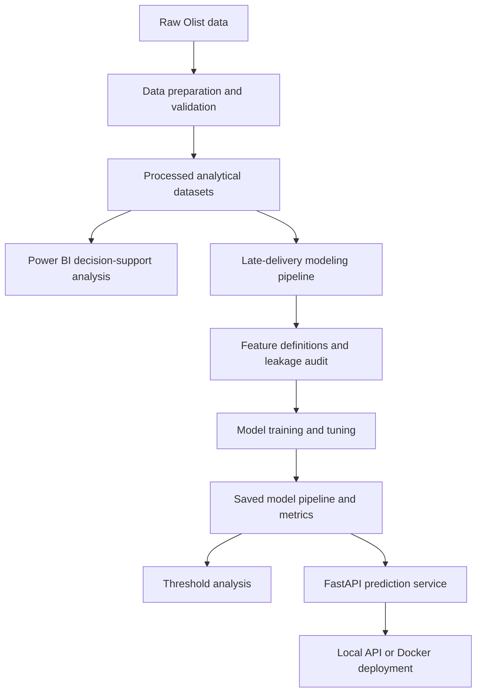

# Olist Revenue Intelligence Command Center

Business intelligence, late-delivery risk modeling, and lightweight AI engineering for the Brazilian Olist e-commerce dataset.

## Overview

This project combines three complementary layers:

1. **Business intelligence** to identify markets and product segments exposed to operational friction.
2. **Predictive modeling** to estimate late-delivery risk at order level before the delivery outcome is known.
3. **Lightweight AI engineering** to package the retained model into reproducible Python workflows, saved artifacts, tests, Docker configuration, and a small FastAPI service.

The project started as a BI and decision-support analysis. Its central business thesis is that Olist's strategic challenge is not revenue generation alone, but the uneven exposure of valuable markets and product segments to delivery friction.

The machine-learning extension translates this business problem into an operational prioritization use case: identifying orders that may require attention before delays materialize.

---

## Business Problem

Revenue performance should not be analyzed independently from operational execution.

A market or product category may generate substantial revenue while remaining disproportionately exposed to:

* delivery delays;
* operational complexity;
* fragmented seller participation;
* customer dissatisfaction;
* uneven geographical service quality.

The BI layer examines these patterns at market and segment level.

The predictive layer addresses a related order-level question:

> Given the information available before delivery, which orders present the highest risk of arriving late?

The objective is not to automate operational decisions. The model is intended to support prioritization when review or intervention capacity is limited.

---

## Decision Layers

### Business Intelligence

The Power BI component supports strategic and operational analysis across dimensions such as:

* revenue;
* geography;
* product categories;
* order characteristics;
* customer experience;
* delivery performance.

Its purpose is to locate areas where commercially important activity overlaps with operational friction.

### Predictive Risk Modeling

The modeling component estimates the probability that an individual order will be delivered late.

Only information available before the delivery outcome is retained. Variables based on reviews, actual delivery timestamps, and other post-outcome information are excluded to reduce target leakage.

### Local Model Serving

The retained pipeline is exposed through a small FastAPI application.

The API demonstrates how the model artifact can be loaded and queried locally. It is a portfolio-oriented serving layer, not a production deployment platform.

---

## Solution Architecture



The Power BI and machine-learning components use the same broader business context but serve different decision levels:

* Power BI supports market- and segment-level diagnosis.
* The predictive model supports order-level risk prioritization.
* FastAPI demonstrates local model consumption.

---

## What This Repository Demonstrates

### Analytics and modeling

* Business-first problem formulation
* Order-level late-delivery target definition
* Leakage-aware feature selection
* Benchmark model comparison
* Random Forest and XGBoost tuning
* Threshold-based operating analysis
* Business interpretation of precision–recall trade-offs

### Python and AI engineering

* Modular package structure under `src/`
* Reproducible training and tuning scripts
* Saved pipelines and supporting artifacts
* Configuration-driven feature definitions
* FastAPI model serving
* Request and response validation
* Basic pytest coverage
* Docker packaging for local serving

This repository is intentionally scoped as a strong local analytics and AI-engineering project.

It does **not** claim to implement a complete enterprise MLOps platform. The project deliberately excludes:

* cloud deployment;
* MLflow;
* Airflow;
* Kubernetes;
* authentication and authorization;
* automated CI/CD;
* live monitoring;
* frontend application frameworks.

---

## Modeling Scope

The prediction target is:

```text
is_late
```

The model predicts late-delivery risk at order level.

### Leakage control

The feature set is restricted to variables that can reasonably be known before delivery.

Excluded variables include:

* actual delivery information;
* customer reviews;
* post-outcome timestamps;
* variables directly derived from the final delivery result.

This prevents the model from relying on information that would not be available when an operational decision must be made.

### Expected model inputs

The retained model uses the following features:

* `order_revenue`
* `n_items`
* `n_sellers`
* `n_categories`
* `customer_state`
* `estimated_delivery_days`
* `purchase_month`
* `purchase_dayofweek`
* `purchase_hour`
* `is_weekend`
* `order_revenue_per_item`

---

## Retained Model

The retained operational configuration is:

```text
model = tuned XGBoost
threshold = 0.70
```

The complete preprocessing and prediction logic is saved as a reusable model pipeline.

The retained threshold should not be interpreted as a universally optimal classification threshold. It represents one specific operating mode.

### Strict-escalation interpretation

At a threshold of `0.70`, the model generates very few positive alerts.

This produces the following behavior:

* relatively high confidence in the orders that are flagged;
* very limited coverage of all late deliveries;
* high precision relative to broader thresholds;
* extremely low recall.

This configuration is appropriate only when:

* manual review capacity is limited;
* false alerts are costly;
* the objective is to escalate a small number of high-risk cases.

It is not appropriate when the business objective is to detect a large proportion of all delayed orders.

The model should therefore be treated as a **risk-ranking and prioritization tool**, not as an autonomous decision system.

---

## Project Structure

```text
data/
  raw/                        Raw data placeholders
  processed/                  Processed analytical and modeling datasets
  exports/                    Generated analytical exports

notebooks/
  ...                         Original BI and data-science notebooks

powerbi/
  ...                         Power BI report files and screenshots

src/
  olist_revenue_intelligence/
    config/                   Settings and retained feature configuration
    data/                     Loading, validation, and export helpers
    features/                 Feature definitions, preprocessing, leakage audit
    models/                   Training, tuning, evaluation, registry, prediction
    api/                      FastAPI schemas, services, and routes
    utils/                    Paths, logging, and shared helpers

models/
  trained/                    Saved model pipelines
  metrics/                    Evaluation and threshold artifacts
  ...                         Additional generated model outputs

scripts/
  ...                         Executable local workflows

tests/
  ...                         Lightweight pytest suite

deployment/
  Dockerfile
  compose.yaml
  start.sh                    Local container startup configuration

docs/
  ...                         Portfolio-oriented documentation
```

---

## Installation

### 1. Clone the repository

```bash
git clone <repository-url>
cd olist-revenue-intelligence
```

### 2. Create a virtual environment

```bash
python -m venv .venv
```

On Windows:

```bash
.venv\Scripts\activate
```

On macOS or Linux:

```bash
source .venv/bin/activate
```

### 3. Install the project

```bash
python -m pip install --upgrade pip
pip install -r requirements.txt
pip install -e .
```

---

## Data Requirements

The modeling workflow expects a processed order-level dataset at:

```text
data/processed/late_delivery_modeling_dataset.csv
```

Expected minimum columns:

* `order_id`
* `is_late`
* `order_revenue`
* `n_items`
* `n_sellers`
* `n_categories`
* `customer_state`
* `estimated_delivery_days`
* `purchase_month`
* `purchase_dayofweek`
* `purchase_hour`
* `is_weekend`
* `order_revenue_per_item`

The repository structure separates raw data, processed datasets, exports, trained models, and generated evaluation artifacts.

---

## Run the Modeling Workflow

The scripts are separated by responsibility so that individual stages can be rerun independently.

### Validate the modeling dataset

Validate the processed dataset and export the leakage audit:

```bash
python scripts/run_build_modeling_dataset.py
```

### Train benchmark models

Train the benchmark model set:

```bash
python scripts/run_train_all_models.py
```

### Tune candidate models

Tune Random Forest and XGBoost, then retain the tuned XGBoost pipeline:

```bash
python scripts/run_tuning.py
```

### Analyze classification thresholds

Generate threshold-analysis artifacts for the retained model:

```bash
python scripts/run_threshold_analysis.py
```

### Export portfolio artifacts

Export lightweight metrics, configuration, and model documentation artifacts:

```bash
python scripts/run_export_artifacts.py
```

---

## Launch the API

Run the API locally:

```bash
python scripts/run_api_local.py
```

Open the interactive API documentation at:

```text
http://localhost:8000/docs
```

### Main endpoints

* `GET /health`
* `GET /model-info`
* `POST /predict`

### Example prediction request

```json
{
  "order_revenue": 141.46,
  "n_items": 1,
  "n_sellers": 1,
  "n_categories": 1,
  "customer_state": "SP",
  "estimated_delivery_days": 19.1,
  "purchase_month": 7,
  "purchase_dayofweek": 1,
  "purchase_hour": 20,
  "is_weekend": 0,
  "order_revenue_per_item": 141.46
}
```

The prediction response provides the model's estimated late-delivery risk and the classification associated with the retained operating threshold.

---

## Docker

From the `deployment/` directory:

```bash
docker compose up --build
```

The API will be available at:

```text
http://localhost:8000
```

The Compose configuration mounts the local `models/` directory so that the API can load:

```text
models/trained/best_model_pipeline.joblib
```

The Docker setup is intended for local reproducibility and serving demonstrations. It does not imply cloud or enterprise production readiness.

---

## Testing

Run the test suite with:

```bash
pytest
```

The tests use:

* small synthetic datasets;
* temporary model artifacts;
* isolated API and pipeline checks.

They do not require the complete Olist dataset or the committed retained model artifact.

---

## Scope and Limitations

* The model supports operational prioritization, not autonomous decision-making.
* The retained `0.70` threshold represents strict high-confidence escalation.
* The retained threshold has very low recall and should not be presented as broad delay detection.
* Alternative thresholds should be evaluated according to intervention capacity and the relative costs of false positives and false negatives.
* The feature set is intentionally narrow and leakage-aware.
* The API processes one order at a time for clarity.
* The Docker setup is local-only.
* No cloud infrastructure, production monitoring, authentication, or automated retraining is implemented.
* Model metrics must be interpreted in the context of delivery-risk triage and business cost trade-offs.

---

## Intended Portfolio Signal

This project demonstrates the ability to connect:

* business analysis;
* decision-support reporting;
* leakage-aware predictive modeling;
* model evaluation and threshold selection;
* modular Python engineering;
* local API serving;
* testing and containerization.

The central objective is not to maximize technical complexity. It is to package an analytically coherent business problem into a reproducible and interpretable applied-AI workflow.
